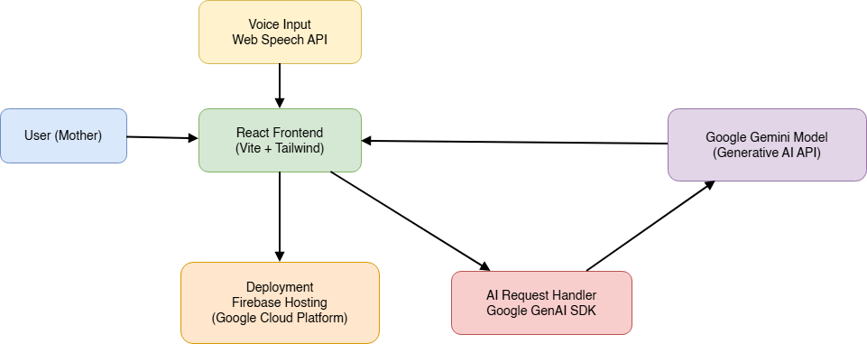

# MAIA - Maternal Artificial Intelligence Assistant

## Project Title

**MAIA - Maternal Artificial Intelligence Assistant**

## Overview

MAIA (Maternal Artificial Intelligence Assistant) is an AI-powered web application designed to support pregnant and postpartum mothers with accessible, responsive, and practical guidance. Built with Gemini AI and modern web technologies, the platform combines conversational AI, voice interaction, and maternal support tools to help users navigate symptoms, labor preparation, and day-to-day decision-making with greater confidence.

The project is motivated by the need for more consistent maternal support, especially for users who may face barriers to real-time care, education, or advocacy resources.

[](https://maia-ai-doula-f5a03.web.app/Dashboard)

## System Architecture

The MAIA architecture is designed for a responsive conversational maternal-support experience. User interactions are handled in the React frontend, voice input is captured through browser APIs, and AI prompts are routed through the app request layer before responses are rendered back in the interface.

Flow:
User -> React Frontend (Vite + Tailwind) -> Voice Input (Web Speech API) -> AI Request Handler (`src/lib/app-client.js`) -> Gemini -> Response returned to UI -> Deployment on Firebase Hosting (Google Cloud)



## Features

- **AI conversational support** for pregnancy and postpartum questions
- **Voice interaction** using browser speech recognition and speech synthesis
- **Symptom awareness tools** with stage-based triage guidance
- **Guided breathing exercises** for calming and labor-focused routines
- **Contraction tracking interface** with timing and intensity logging
- **Maternal advocacy resources** with rights, communication phrases, and support links
- **Camera-assisted symptom review** using multimodal AI prompts
- **Support contacts management** for emergency and care-network access

## Tech Stack

### Frontend

- React
- Vite
- TailwindCSS

### AI Layer

- Gemini AI

### Voice Interaction

- Web Speech API

### Cloud Infrastructure

- Firebase Hosting (Google Cloud)

## Architecture Overview

MAIA runs as a React single-page application. Users interact through text, voice, and optional image input. Requests are routed through the app's integration layer, which invokes Gemini AI for conversational and multimodal responses. The interface then renders guidance, while local app entities support user-facing workflows such as symptom logs, contraction history, and contacts.

## Project Structure

```text
MAIA/
|-- docs/
|   `-- architecture-diagram.png # System architecture diagram (manually added)
|-- entities/                 # Data entity definitions (Contact, Contraction, SymptomLog)
|-- src/
|   |-- components/           # Shared UI and feature components
|   |-- lib/                  # App client, auth context, and utilities
|   |-- pages/                # Feature pages (Dashboard, Breathing, SymptomChecker, etc.)
|   |-- App.jsx               # Application routing and layout wiring
|   `-- main.jsx              # App bootstrap entry point
|-- index.html                # Vite HTML entry
`-- package.json              # Scripts and dependencies
```

## Setup Instructions

1. Clone the repository:

```bash
git clone <repository-url>
cd MAIA
```

2. Install dependencies:

```bash
npm install
```

3. Create a `.env` file in the project root and add required API keys:

```env
VITE_GEMINI_API_KEY=your_gemini_api_key_here
```

4. Run the development server:

```bash
npm run dev
```

## Deployment

The MAIA web application is deployed using **Firebase Hosting**, which runs on Google Cloud infrastructure. The production build generated by Vite is deployed as a static site, allowing the application to be accessed globally with low latency.

Example deployment workflow:

- Build the application using:

```bash
npm run build
```

- Deploy the production build using Firebase CLI:

```bash
firebase deploy --only hosting
```

The live hosted application can be accessed via the Firebase Hosting URL.

## Live Demo

https://maia-ai-doula-f5a03.web.app

## Team

### Ahtasham Ul Haq

https://www.linkedin.com/in/mr-ahtasham-ul-haq/

### Andrea Scales

https://www.linkedin.com/in/andreascales/

### Agrika Gupta

https://www.linkedin.com/in/agrika-gupta/
